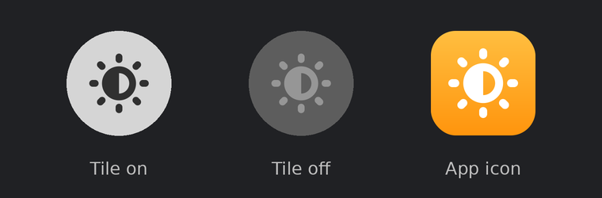

# Auto Brightness Tile

[](../../releases/latest)
[](../../actions/workflows/build.yml)

[](LICENSE)

A one-tap **adaptive brightness** button for Samsung One UI's quick panel. It also works on any other phone running Android 8.0 or newer.

One UI hides adaptive brightness behind the ⋮ menu next to the brightness slider. This app puts it on a proper quick panel button, with **no Shizuku, no ADB and no root**.

<p align="center">
  
</p>

## Features

- **One-tap toggle.** Tap the tile to turn adaptive brightness on or off. The subtitle reads **On** or **Off**.
- **Always in sync.** The tile updates when you change the setting somewhere else, such as Samsung's own brightness menu.
- **Long-press shortcut.** Long-press the tile to go straight to Display settings.
- **Guided setup screen** (iOS-style, light and dark):
  - grant the permission
  - add the tile to the quick panel in one tap (Android 13+)
  - flip adaptive brightness with a live switch
- **Tiny and private.** The APK is about 40 KB. It has no internet permission, no ads and no tracking.

## Install

1. Download the latest APK from [Releases](../../releases/latest).
2. Install it. If asked, allow "Install unknown apps" for your browser or file manager. On One UI, turn off **Auto Blocker** for a moment if it blocks the install.
3. Open **Auto Brightness Tile**, tap **Modify system settings**, and turn on **Allow permission**.
4. Tap **Quick panel tile → Add**. On Android 12 and older, or if the prompt doesn't show up, open the quick panel, tap the pencil (edit) icon and drag **Auto Brightness** into your buttons.

Skipped step 3? The tile says **Tap to set up**, and tapping it takes you to the permission screen.

To update, install the newer APK over the old one. Your settings and the tile stay in place.

## How it works

Adaptive brightness is Android's standard `Settings.System.SCREEN_BRIGHTNESS_MODE` setting. Changing it only needs the **Modify system settings** permission (`WRITE_SETTINGS`), which you grant yourself with a normal switch in Settings. That's why no Shizuku, ADB or root is involved.

The tile is a regular `TileService`, so it sits next to the system buttons and follows your quick panel's own style.

### Permissions

| Permission | Why |
| --- | --- |
| `WRITE_SETTINGS` (Modify system settings) | Turning adaptive brightness on and off. Nothing else is changed. |

That's the only one. The app can't go online and doesn't collect anything.

## Troubleshooting

- **The tile stays on "Tap to set up".** Go to Settings → Apps → Auto Brightness Tile → **Modify system settings** (on some phones it's under **Special access**) and turn it on.
- **Tapping the tile on the lock screen asks me to unlock.** That only happens before the permission is granted, because the permission screen can't open over the lock screen.
- **The install is blocked.** Turn off One UI's **Auto Blocker** (Settings → Security and privacy → Auto Blocker), install, then turn it back on.
- **"App not installed" after building it myself.** An APK signed with a different key can't replace an installed one. Uninstall the old copy first.

## Requirements

- Android 8.0 (API 26) or newer
- Designed and tested for Samsung One UI 8 (Android 16); targets API 36

## Build from source

No Gradle or Android Studio needed. `build.sh` uses the standard command-line Android tools:

```bash
sudo apt install aapt apksigner zipalign dalvik-exchange default-jdk-headless curl zip
./build.sh
```

The script:

1. downloads `android.jar` (API 34) to `.sdk/` on first run
2. compiles resources with `aapt2`
3. compiles Java with `javac`
4. converts to dex with `dx`
5. aligns with `zipalign` and signs with `apksigner` (v2 + v3 signatures)

The APK lands in `build/`.

The first build creates a signing key in `keystore/` (git-ignored). Set `KS` and `KS_PASS` to use your own keystore, or `SDK_JAR` to point at an `android.jar` you already have. An APK signed with your own key can't update one installed from Releases, so uninstall the Releases version first.

GitHub Actions builds every push and pull request. Download the APK from the run's artifacts in the **Actions** tab.

## Project layout

```
AndroidManifest.xml
src/com/kasana/autobrightness/
  AutoBrightnessTileService.java   quick panel tile
  MainActivity.java                setup screen
  IosSwitch.java                   iOS-style switch view
  TilePrefsActivity.java           long-press → Display settings
  Brightness.java                  reads/writes the brightness mode
res/                               icons, strings, themes (light + dark)
NOTICE                             third-party license notes
release/                           signed release APKs and their notes
build.sh                           Gradle-free build script
```

## Credits

The half-sun tile and app icon is an original design, drawn to match the size and stroke weight of One UI's own quick panel icons. The two small row icons on the setup screen (key and app grid) come from Google's [Material Icons](https://github.com/google/material-design-icons) under the Apache License 2.0. That license ships inside the APK at `assets/LICENSE-material-symbols.txt`; see [NOTICE](NOTICE).

Not affiliated with Samsung or Google.

## License

[MIT](LICENSE)
